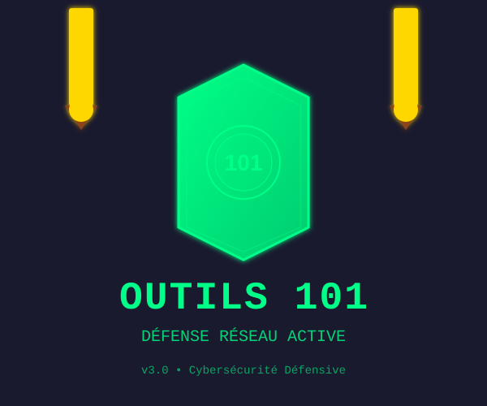

# 🛡️ Logos Outils 101 - Défense Réseau

## 📋 Description

Outils 101 utilise un logo représentant une **défense active** :
- **🛡️ Bouclier central** = Protection de ton réseau WiFi
- **⚔️ Épée gauche** = Détection d'intrusions (IDS)
- **⚔️ Épée droite** = Forensics & Honeypot

Ce triptyque symbolise une approche **défensive et proactive** de la cybersécurité.

---

## 📁 Fichiers de Logo

### 1. **ASCII Art** (Terminal)
- **Fichier** : `outils101/banner_new.py`
- **Usage** : Affichage au démarrage du programme
- **Format** : Caractères Unicode et émojis
- **Avantage** : Fonctionnel sur tous les terminaux (Linux, Windows, macOS)

```
            ⚔️   OUTILS 101 CYBERSÉCURITÉ   ⚔️
                      Épée Gauche
                           ⚔️
                            |
                        _____|____
                       /   🛡️    \
                      |  DÉFENSE  |
                       \   101   /
                        \       /
                         ╰─────╯
                            |
                            ⚔️
                      Épée Droite
```

### 2. **HTML Interactif** (Navigateur)
- **Fichier** : `logo.html`
- **Format** : HTML5 + CSS3 avec animations
- **Animations** : 
  - Épées qui se balancent (swing-left, swing-right)
  - Bouclier qui pulse (émet une lumière)
  - Gradients verts (cybersécurité)
- **Usage** : Ouvre dans un navigateur pour une présentation visuelle

**Comment l'utiliser** :
```bash
# Linux/macOS
open logo.html

# Windows
start logo.html

# Ou double-clique simplement sur le fichier
```

### 3. **SVG Vectoriel** (Professionnel)
- **Fichier** : `logo.svg`
- **Format** : Scalable Vector Graphics
- **Avantage** : Redimensionnable sans perte de qualité
- **Animations** : Basées sur CSS (épées qui swingent, bouclier qui pulse)
- **Usage** : Logo pour documentation, présentations, pages web

**Comment l'utiliser** :
```bash
# Afficher dans le navigateur
open logo.svg

# Utiliser dans du HTML


# Intégrer dans un PDF (via un outil)
```

---

## 🎨 Couleurs du Logo

| Élément | Couleur | Code |
|---------|---------|------|
| Bouclier | Vert Cybersécurité | `#00ff88` |
| Contour | Vert Bright | `#00cc6f` |
| Épées | Or | `#FFD700` |
| Poignée | Marron | `#8B4513` |
| Fond | Bleu Foncé | `#1a1a2e` |

---

## 🚀 Affichage au Démarrage

### Dans le Terminal

Quand tu lances `python3 main.py` (ou `python main.py` sur Windows), tu verras :

```
╔════════════════════════════════════════════════════════════╗
║            ⚔️   OUTILS 101 CYBERSÉCURITÉ   ⚔️            ║
║                      Épée Gauche                           ║
║                           ⚔️                              ║
║                      [Épées & Bouclier]                    ║
║                   ⚔️ LINUX • WINDOWS • macOS ⚔️          ║
║              Surveillance • Audit • Détection             ║
║                    d'Intrusions Réseau                    ║
╚════════════════════════════════════════════════════════════╝
```

Suivi de :

```
╔═══════════════════════════════════════════════════════════════╗
║  ⚔️  BIENVENUE DANS OUTILS 101 - ÉDITION DÉFENSIVE  ⚔️       ║
║  🛡️ BOUCLIER = Protection de ton réseau WiFi               ║
║  ⚔️ ÉPÉE GAUCHE = Détection d'intrusions (IDS)             ║
║  ⚔️ ÉPÉE DROITE = Forensics & Honeypot                     ║
║  Outils 100% LÉGAUX • Défensifs • Éthiques                  ║
╚═══════════════════════════════════════════════════════════════╝
```

---

## 📊 Menú avec Header

Chaque affichage du menu montre :

```
┌───────────────────────────────────────────────────────┐
│  🛡️ MENU PRINCIPAL - OUTILS 101 v3.0 DÉFENSIF         │
│                                                       │
│  ⚔️ ÉPÉE GAUCHE  │  🛡️ BOUCLIER  │  ⚔️ ÉPÉE DROITE  │
│  Intrusions    │  Réseau WiFi  │  Forensics      │
│                                                       │
└───────────────────────────────────────────────────────┘
```

---

## 🔧 Personnalisation

### Changer les Couleurs (HTML)
Dans `logo.html`, cherche la section `<style>` et modifie :

```css
.shield {
    background: linear-gradient(135deg, #00ff88 0%, #00cc6f 100%);
    /* Remplace les codes couleur */
}
```

### Changer l'ASCII (Terminal)
Dans `outils101/banner_new.py`, modifie la fonction `print_logo_ascii()` :

```python
def print_logo_ascii():
    logo = """
    Ton design ASCII ici...
    """
    print(logo)
```

### Changer les SVG (Professionnel)
Édite `logo.svg` directement (c'est du XML simple) :

```xml
<linearGradient id="shieldGradient" x1="0%" y1="0%" x2="100%" y2="100%">
    <stop offset="0%" style="stop-color:#00ff88;stop-opacity:1" />
    <stop offset="100%" style="stop-color:#00cc6f;stop-opacity:1" />
</linearGradient>
```

---

## 💡 Utilisation

### Pour les Présentations
Utilise **logo.html** (beau, animé, professionnel)

### Pour les Documentation
Utilise **logo.svg** (redimensionnable, intégrable)

### Pour le Terminal
Utilise **ASCII** automatiquement (s'affiche au démarrage)

### Pour les Réseaux Sociaux
- Exporte logo.svg en PNG (haute résolution)
- Utilise les couleurs RGB correspondantes

---

## 🎯 Symbolique

| Symbole | Signification |
|---------|---------------|
| 🛡️ | Protection défensive, sécurité active |
| ⚔️ | Attaque justifiée (pentest), défense proactive |
| Deux épées | Double approche (détection + forensics) |
| Couleur verte | Cybersécurité, "hacker éthique" |
| Animations | Activité dynamique, surveillance en temps réel |

---

## 🚀 Prochaines Étapes

1. **Terminal** → Voir le logo au démarrage avec `python main.py`
2. **Navigateur** → Ouvre `logo.html` pour une présentation animée
3. **Documentation** → Utilise `logo.svg` dans tes docs

---

**Outils 101 v3.0 - Logo Défensif Complet** 🛡️⚔️

*ASCII • HTML • SVG • Animations • Symboles*
